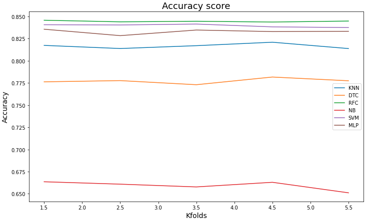

# Rain Prediction Using Machine Learning Models

## Project Description
This project aims to predict the likelihood of rain using weather tabular data. Several machine learning algorithms were implemented, including:  
- **K-Nearest Neighbors (KNN)**  
- **Random Forest**  
- **Decision Tree**  
- **Naive Bayes**  
- **Support Vector Machine (SVM)**  
- **Multi-Layer Perceptron (MLP)**  

### Workflow
- **Data Exploration and Cleaning**:  
  Conducted analysis and preprocessing to handle missing values and outliers.  
- **Data Pipeline Construction**:  
  Built a pipeline with data imputation and categorical encoding to prepare data for model training.  
- **Model Training**:  
  Trained multiple machine learning models to compare performance.  
- **Cross-Validation**:  
  Applied cross-validation to select the best-performing model.  
- **Hyperparameter Tuning**:  
  Used grid search with cross-validation to fine-tune model parameters for optimal accuracy.  

This project showcases an end-to-end machine learning workflow for weather prediction, emphasizing model evaluation and efficient data handling techniques.

    

